

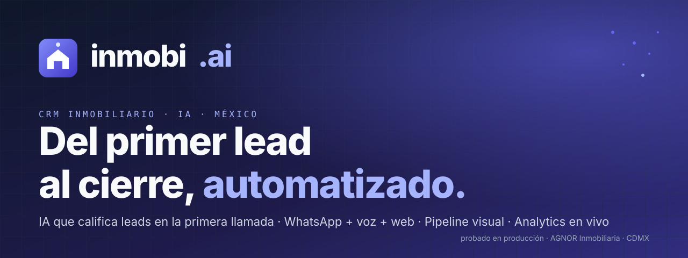

 

# El sistema operativo para inmobiliarias que cierran de verdad.

**Tu pipeline merece más que una hoja de Excel.** Un CRM construido desde cero para inmobiliarias mexicanas.

---

## № 01 — El problema

> En real estate cada hora que un lead espera, su intención se enfría. Las inmobiliarias mexicanas pierden el 60% de los leads en las primeras 24 horas porque nadie contesta a tiempo, nadie califica, y nadie da seguimiento.

Innmobi.ai cambia esa ecuación. No es otro CRM con IA. Es el sistema operativo que tu inmobiliaria debió tener desde hace tres años: cuando entra un prospecto por llamada, WhatsApp o formulario web, lo califica en segundos, lo asigna al asesor correcto, agenda la cita, y mantiene la conversación viva hasta el cierre.

Está construido para el flujo del corredor inmobiliario mexicano: remates bancarios, preventa, corretaje, recuperadas, reventa y rentas.

---

## № 02 — Tres pilares

<table>
<tr>
<td width="33%" valign="top">

**Inteligencia que no se cansa**

Contesta a las once de la noche. Califica al lead en 90 segundos. Entrega un perfil estructurado al asesor antes de que cuelgue el teléfono.

</td>
<td width="33%" valign="top">

**Una sola fuente de verdad**

Llamadas, WhatsApp, web, citas y notas — todo en un timeline cronológico por prospecto. Cero pestañas, cero "se me pasó".

</td>
<td width="33%" valign="top">

**Hecho con asesores en CDMX**

No se diseñó en un Notion. Se construyó en piso, vendiendo remates bancarios, con feedback de los asesores que cierran.

</td>
</tr>
</table>

---

## № 03 — Ocho capacidades core

| | Capacidad | Qué hace |
|---|---|---|
|  | **Captura + perfilado IA** | Voz Retell + WhatsApp + web. Claude perfila en la primera interacción. |
|  | **Pipeline visual** | Kanban drag-and-drop. La transición se registra en el timeline. |
|  | **Timeline unificado** | Cinco canales en un hilo cronológico, buscable, exportable. |
|  | **WhatsApp Business** | 21 plantillas Meta + free-form 24h + envío masivo segmentado. |
|  | **Citas + Google Calendar** | Sync bidireccional. Conflictos detectados, recordatorios automáticos. |
|  | **Analytics en vivo** | Funnel, velocity, forecast, ROI por canal, leaderboard. |
|  | **Seis verticales** | Remates, preventa, corretaje, recuperadas, reventa, rentas. |
|  | **Mercado Libre sync** | Publica/despublica con un click. Auto-sync al editar. |

---

## № 04 — En movimiento

> Tres flujos en bucle. SVG animado puro — sin video, sin hosting, autoplay everywhere.

<table>
<tr>
<td width="33%"></td>
<td width="33%"></td>
<td width="33%"></td>
</tr>
<tr>
<td><b>№ 01 — Pipeline</b> El asesor mueve a Carlos Méndez de Calificado a Cita. La transición se registra sola.</td>
<td><b>№ 02 — Inteligencia</b> Llamada entrante → Claude perfila en 90 segundos → asesor recibe lead pre-trabajado.</td>
<td><b>№ 03 — WhatsApp</b> Cita confirmada → recordatorio 1h antes → cliente confirma. Sin manual.</td>
</tr>
</table>

---

## № 05 — El producto, en vivo

> Capturas reales del CRM corriendo. Generadas con Playwright sobre el dev server con datos demo. Para verlo con tu propia data → [agenda por WhatsApp](https://wa.me/525620595320).

<table>
<tr>
<td width="50%">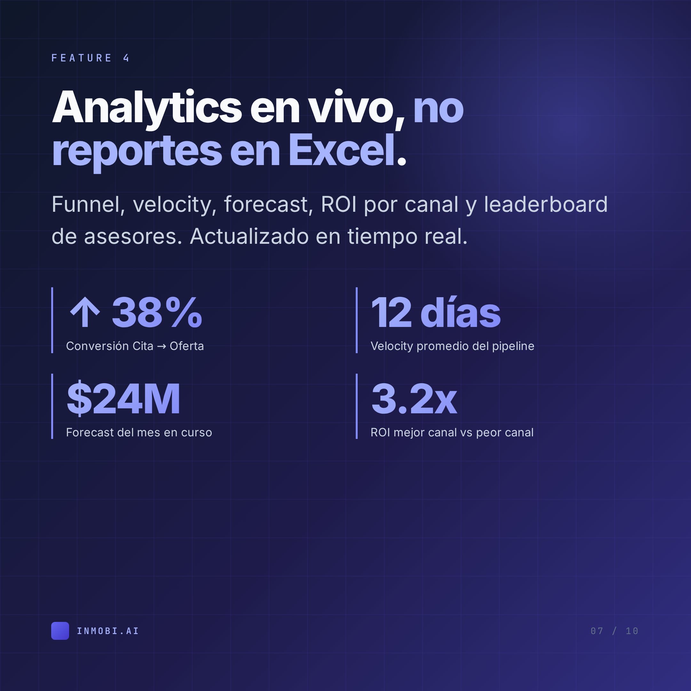</td>
<td width="50%">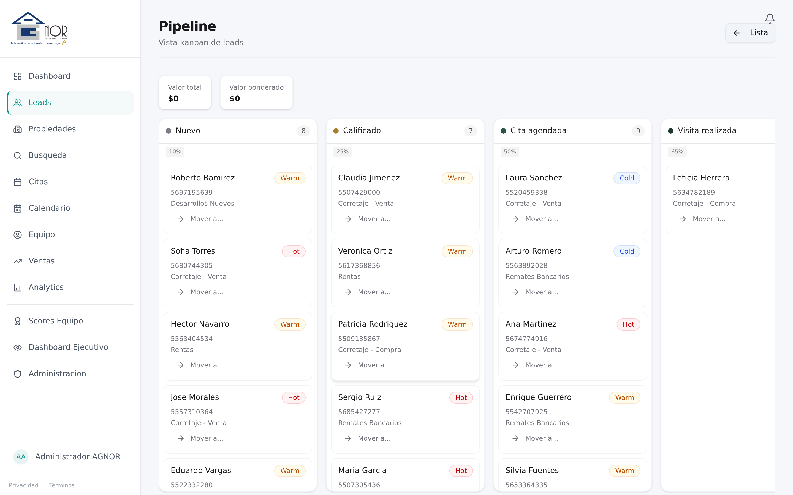</td>
</tr>
<tr>
<td><b>Command Center</b> El asesor abre la app y sabe qué leads requieren atención hoy. KPIs en vivo: pipeline activo, conversión IA, leads sin contactar.</td>
<td><b>Pipeline visual</b> Drag-and-drop por etapa. Una pantalla, todos los asesores. Calificado · Cita · Visita · Oferta · Cierre.</td>
</tr>
<tr>
<td>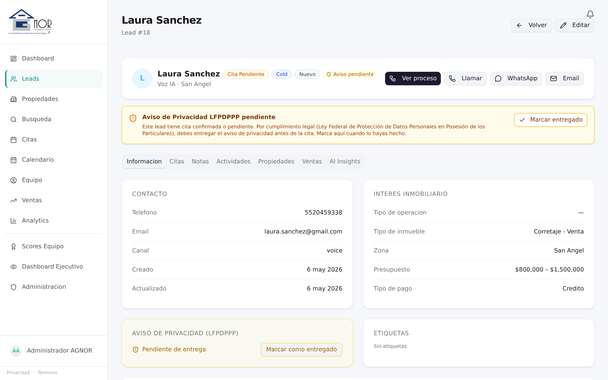</td>
<td>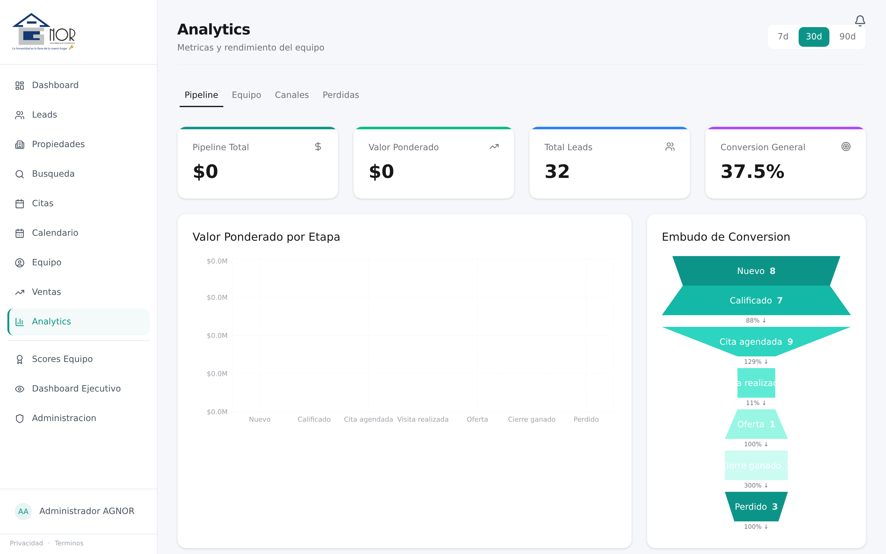</td>
</tr>
<tr>
<td><b>Lead 360°</b> Perfil del prospecto + tabs (Citas, Notas, Actividades, Propiedades, Ventas, AI Insights). Llamar, WhatsApp, Email a un click.</td>
<td><b>Analytics ejecutivo</b> Embudo de conversión por etapa, leads totales, conversión general. Pipeline / Equipo / Canales / Pérdidas.</td>
</tr>
</table>

<b>Ver más capturas</b> (lista de leads, propiedades, calendario, citas, mobile)

<table>
<tr>
<td width="50%">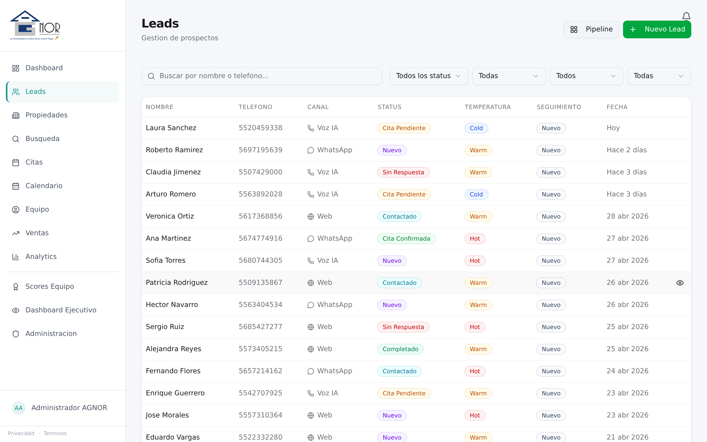</td>
<td width="50%">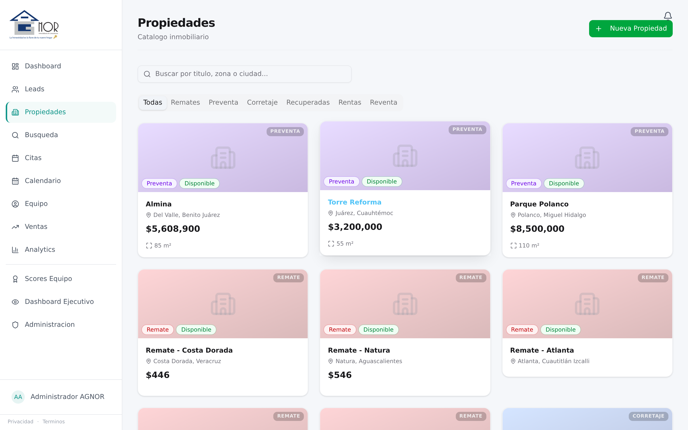</td>
</tr>
<tr>
<td><b>Lista de leads</b> 32 prospectos, filtros por status / temperatura / canal / asesor. Status badges en colores: Nuevo, Cita Confirmada, Sin Respuesta, Completado.</td>
<td><b>Catálogo</b> 11 propiedades vivas. 6 verticales con filtros: Remates · Preventa · Corretaje · Recuperadas · Reventa · Rentas. Cada vertical con su color.</td>
</tr>
<tr>
<td>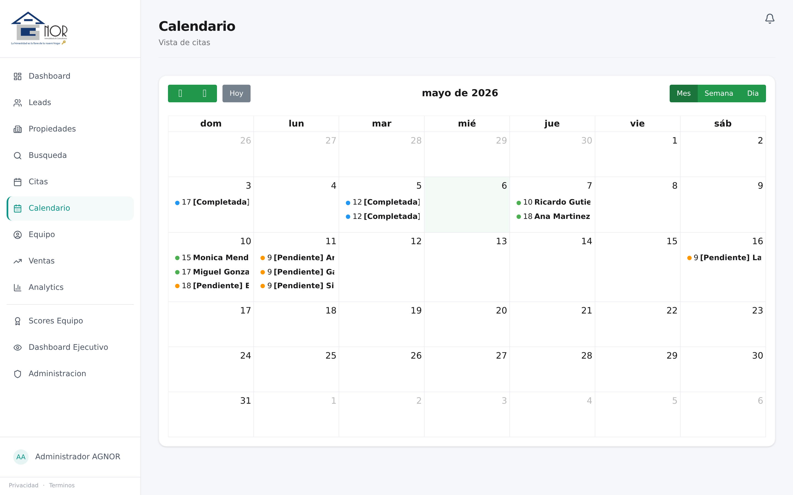</td>
<td>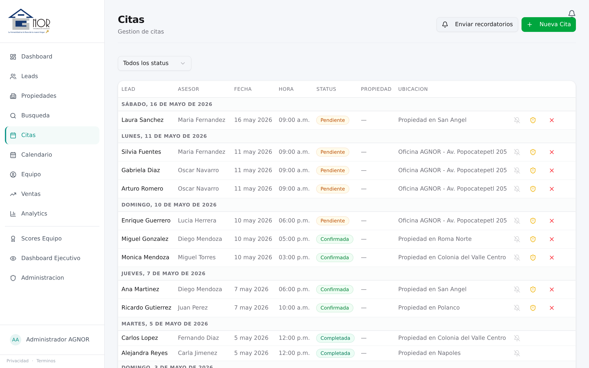</td>
</tr>
<tr>
<td><b>Calendario</b> Vista mensual de citas. Sync bidireccional con Google Calendar. Marcado por status: Completada · Pendiente.</td>
<td><b>Citas</b> Agrupadas por día. Lead, asesor, hora, status, propiedad, ubicación. Recordatorios automáticos por WhatsApp.</td>
</tr>
<tr>
<td colspan="2" align="center">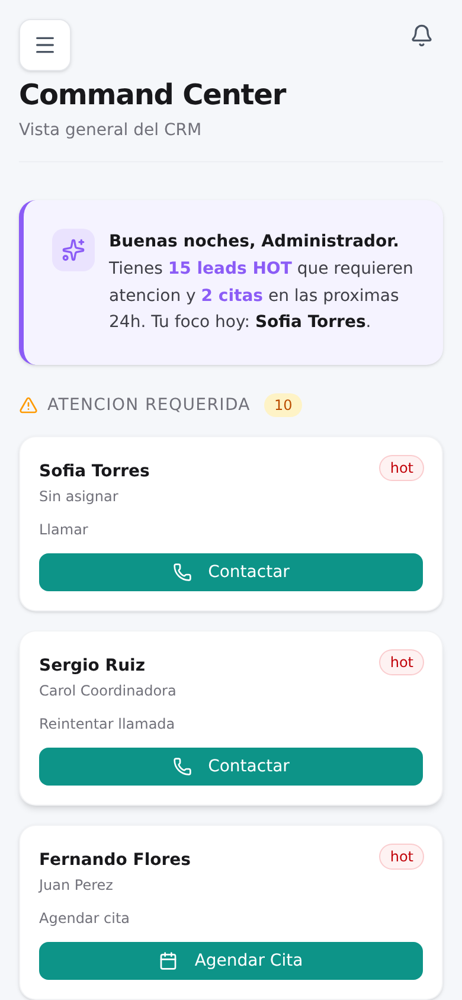</td>
</tr>
<tr>
<td colspan="2" align="center"><b>Mobile-first</b> · Asesor en campo con todo a la mano · Mismo Command Center, optimizado para 390px</td>
</tr>
</table>

---

## № 06 — Stack técnico

`FastAPI` `Python 3.12` `React 18` `TypeScript` `PostgreSQL 16` `SQLAlchemy` `Tailwind CSS` `Anthropic Claude` `Retell LLM` `Meta WhatsApp Cloud API` `Google Calendar API` `Mercado Libre API` `Docker` `Coolify CD`

**Arquitectura**: Domain-Driven Design con Unit of Work pattern. Webhook fail-closed. Tests contra PostgreSQL real, no SQLite mocks que mienten. Deploy blue/green con rollback automático.

---

## № 07 — Probado en piso

> No nació en un garage. Nació en piso, vendiendo remates en CDMX.

**[AGNOR Inmobiliaria](https://agnorinmobiliaria.com)** — especialistas en remates bancarios en la Ciudad de México — usa Innmobi.ai como su sistema operativo de ventas. Cuatro roles. Quince asesores activos. Seis verticales de propiedad. Integraciones con Google Calendar y Mercado Libre. Todo corriendo todos los días en `crm.agnorinmobiliaria.com`.

Cada feature en este producto fue construida para resolver un problema que vivimos en piso. Cuando lo instalas en tu inmobiliaria, no estás financiando experimentos. Estás usando algo que ya gana dinero.

### Lo que dicen quienes ya lo usan

> *"Antes le dedicaba dos horas al lunes haciendo el reporte semanal en Excel. Ahora abro Analytics y todo está. Si un asesor está dejando enfriar leads, el sistema me avisa antes que el cliente reclame."*
>
> — **Coordinadora**, AGNOR Inmobiliaria · CDMX

> *"Cuando entra una llamada, mi celular ya tiene el contexto del cliente antes de que yo conteste. Eso cambió cómo vendo. Ya no llego a frío a una conversación."*
>
> — **Asesor**, AGNOR Inmobiliaria · CDMX

---

## № 08 — Migración en 4 semanas

Sin "rip and replace" caótico. Migración paralela con tu sistema actual hasta que confíes 100%.

| Semana | Foco | Qué pasa |
|---|---|---|
| **01** | Discovery + Data | Auditamos tu pipeline. Exportamos data desde Hubspot/Pipedrive/Excel. Mapeamos roles, verticales, plantillas WhatsApp. KPIs de éxito a 30 días. |
| **02** | Configuración | Setup WhatsApp Business API (te ayudamos con Meta). Conexión Mercado Libre. Sync Google Calendar. Importación de inventario. |
| **03** | Entrenamiento + Paralelo | Sesiones live con asesores y coordinadores (1.5h × rol). Una semana corriendo en paralelo. Tu equipo califica y reporta. Iteramos. |
| **04** | Cutover + Soporte | Migración total. Soporte directo del CEO de OrzaTech vía WhatsApp. Reporte de adopción a los 30 días. Roadmap a 3 meses. |

---

## № 09 — Preguntas frecuentes

<b>¿Cuánto cuesta?</b>

Pricing por asesor activo, ajustado al tamaño de tu equipo y volumen de leads. No publicamos lista pública porque las inmobiliarias chicas pagan distinto que las que cierran 100M al año. Hablemos 30 minutos y te damos un número específico para tu caso.

<b>¿Cómo migro desde Hubspot, Pipedrive o Excel?</b>

Importadores nativos para los 3. Te ayudamos a exportar tu data, mapearla a la estructura de Innmobi.ai (leads, propiedades, asesores, citas), y validar que nada se pierda. La migración completa toma 4 semanas con tu equipo trabajando normal en paralelo.

<b>¿Necesito WhatsApp Business API? ¿Cómo lo consigo?</b>

Sí, pero te acompañamos en el alta con Meta (proceso de ~10 días que se hace una sola vez). Si ya tienes WhatsApp Business standard, te ayudamos a migrar al Business API sin perder tu número actual.

<b>¿Cumple con la LFPDPPP (Ley de Privacidad de Datos)?</b>

Sí. AGNOR Inmobiliaria ya opera bajo cumplimiento. El sistema incluye gestión de avisos de privacidad por lead, consentimiento explícito antes de cada cita, y export/borrado de data cuando un cliente lo solicita.

<b>¿Funciona con Mercado Libre?</b>

Integración nativa con la API de Mercado Libre Inmuebles. Publica con un click, sincroniza precio y status automáticamente, despublica al marcar como vendida. Las llamadas que entran por ML llegan al CRM ya etiquetadas con la fuente.

<b>¿Y si mis asesores no son técnicos?</b>

Es la regla, no la excepción. La UI fue diseñada con asesores no-técnicos en piso de AGNOR. La curva de aprendizaje es ~2 horas — y el agente de voz reduce la dependencia de que el asesor capture cosas manualmente.

<b>¿Quién es dueño de mi data?</b>

Tú. Siempre. Export completo en CSV y JSON disponible en cualquier momento desde admin. Si decides irte, te exportamos toda la data y la borramos de nuestros servidores en menos de 30 días.

<b>¿En qué idioma está?</b>

Español 100%, mexicano específicamente. UI, plantillas WhatsApp, agente de voz Claude, copy interno — todo escrito para CDMX. No es traducción, es producto nativo.

<b>¿Funciona en mobile?</b>

Mobile-first responsive. Tu asesor en campo abre el lead desde el celular, marca la cita, registra notas, manda WhatsApp — todo desde la misma URL del CRM, sin app aparte que instalar.

<b>¿Cuánto tarda en estar funcionando?</b>

Cuatro semanas con onboarding completo. Si necesitas algo más rápido, te subimos a la versión core en 5 días — sin integración WhatsApp ni ML — y agregamos lo demás después.

---

## № 10 — Para quién es

- Inmobiliarias con cinco o más asesores que necesitan visibilidad central del pipeline
- Equipos que reciben leads por múltiples canales y los pierden por falta de seguimiento
- Especialistas en remates bancarios o preventa que requieren reglas de negocio específicas
- Brokers que quieren publicar a Mercado Libre sin doble captura
- Coordinadores que necesitan analytics reales, no reportes de Excel los lunes

No es para freelancers solos, ni para flippers de un proyecto, ni para quien busca un CRM gratis con 200 contactos.

---

## № 11 — Cómo empezar

1. **Demo en vivo de 30 minutos** — te enseñamos el sistema corriendo, tú decides
2. **Trial de 14 días** con tu data real importada
3. **Onboarding** con migración desde tu sistema actual (Excel, Hubspot, Pipedrive, lo que sea)
4. **Soporte directo** con el equipo que construyó el producto

### Contacto

| | |
|---|---|
| **WhatsApp** | [+52 56 2059 5320](https://wa.me/525620595320) |
| **Email** | [aibravo@orzatech.com](mailto:aibravo@orzatech.com) |
| **Sitio** | próximamente en [innmobi.ai](https://innmobi.ai) |

---

## Recursos

- 📄 [Brochure PDF](brochure/brochure.pdf) — 2 páginas editoriales con copy completo
- 🎠 [Carrusel № 01 — Sistema operativo](linkedin/carousel-01-features.html) — 10 láminas 1080×1080
- 🎠 [Carrusel № 02 — Stack técnico](linkedin/carousel-02-stack.html) — 8 láminas
- 🎠 [Carrusel № 03 — Caso AGNOR](linkedin/carousel-03-case-study.html) — 10 láminas
- ✍️ [Posts de LinkedIn](linkedin/posts.md) — listos para pegar
- 🏷️ [Banco de hashtags](linkedin/hashtags.md)
- 🎨 [Brand system](BRAND.md)

---

**Innmobi.ai** &nbsp;·&nbsp; un producto de **OrzaTech** &nbsp;·&nbsp; Ciudad de México 🇲🇽

[aibravo@orzatech.com](mailto:aibravo@orzatech.com) &nbsp;·&nbsp; [WhatsApp +52 56 2059 5320](https://wa.me/525620595320)

© 2026 OrzaTech. All rights reserved.

