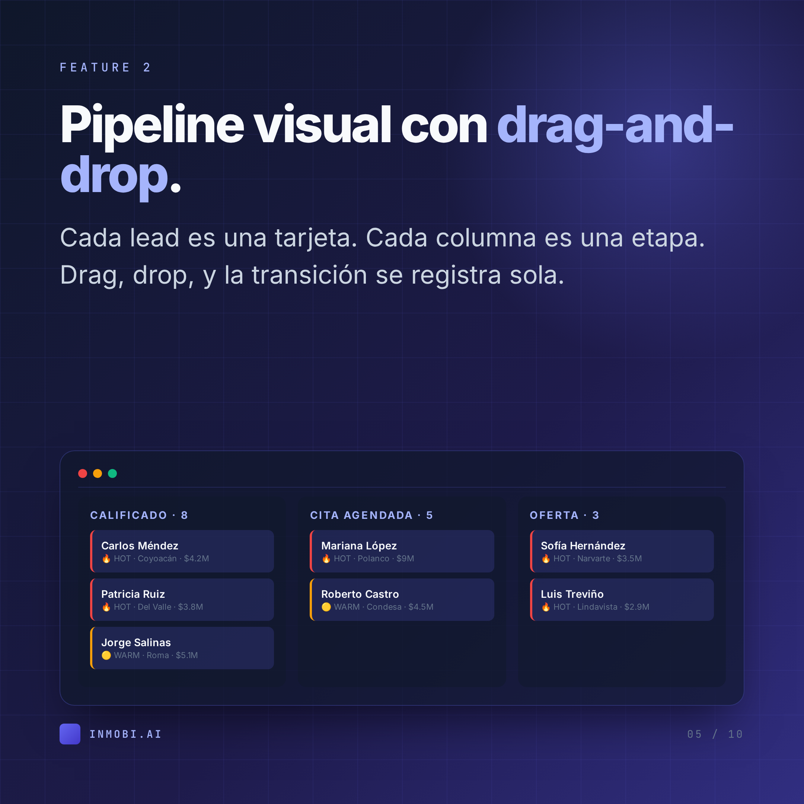
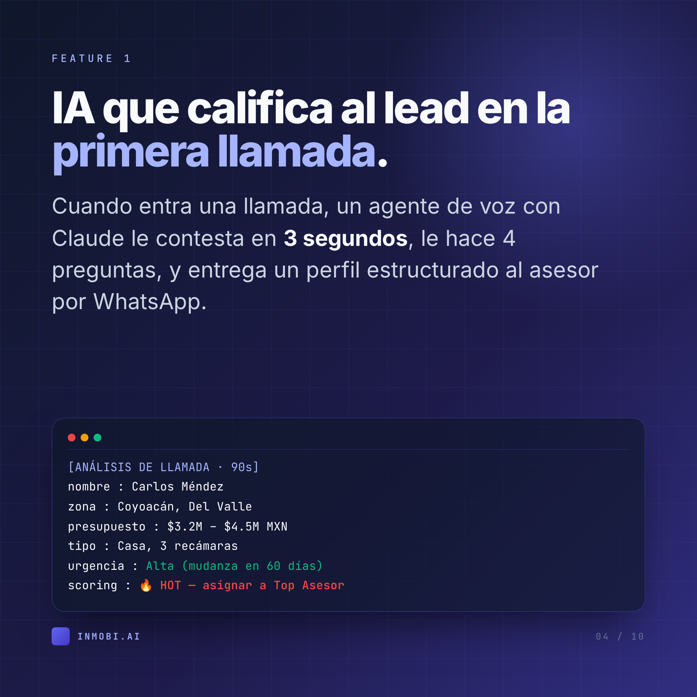
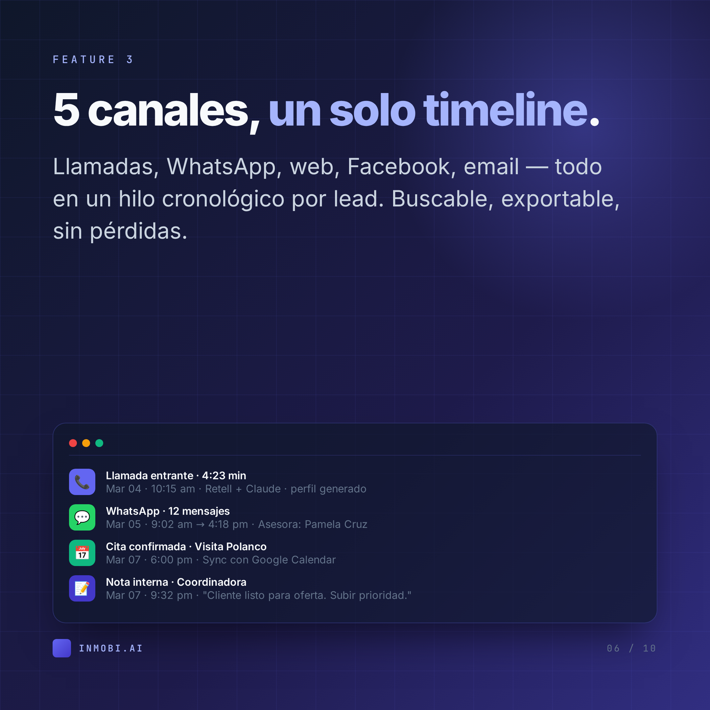

 

# CRM Inmobiliario con Inteligencia Artificial

**Del primer lead al cierre, automatizado.** Construido para inmobiliarias mexicanas.

---

## Por qué Inmobi.ai

> En real estate cada hora que un lead espera, su intención se enfría. Las inmobiliarias mexicanas pierden el 60% de los leads en las primeras 24 horas porque nadie contesta a tiempo, nadie califica, y nadie da seguimiento.

**Inmobi.ai cambia esa ecuación.** Es un CRM construido con IA en el núcleo: cuando un prospecto llega por llamada, WhatsApp, o formulario web, lo califica en segundos, lo asigna al asesor correcto, agenda la cita, y mantiene la conversación viva hasta el cierre.

No es un CRM genérico al que le metieron un chatbot. Es una plataforma diseñada desde cero para el flujo del corredor inmobiliario mexicano: remates bancarios, preventa, corretaje, recuperadas, reventa y rentas.

---

## Tres diferenciadores

<table>
<tr>
<td width="33%" align="center" valign="top">

<h3>IA que califica</h3>

Claude AI escucha la llamada o lee el WhatsApp y entrega un perfil del prospecto antes de que tu asesor cuelgue: zona, presupuesto, urgencia, tipo de propiedad, scoring HOT/WARM/COLD.

</td>
<td width="33%" align="center" valign="top">

<h3>Multi-canal nativo</h3>

Voz (Retell LLM), WhatsApp Business (21 templates Meta-aprobadas), formularios web y Facebook unificados en un solo timeline por lead. Sin pestañas, sin pérdidas.

</td>
<td width="33%" align="center" valign="top">

<h3>Hecho para México</h3>

Especializado en remates bancarios, con 6 verticales soportadas, integración con Mercado Libre, sincronía con Google Calendar y plantillas legales del proceso mexicano.

</td>
</tr>
</table>

---

## 8 capacidades core

| | Capacidad | Qué hace |
|---|---|---|
|  | **Captura + perfilado IA** | Agente de voz Retell + WhatsApp + web. Claude perfila al lead en la primera interacción. |
|  | **Pipeline visual** | Kanban drag-and-drop por etapa. Drag para mover, drop para registrar la transición. |
|  | **Timeline unificado** | Todas las interacciones (llamadas, WhatsApp, notas, citas) en un solo hilo cronológico. |
|  | **WhatsApp Business** | 21 plantillas Meta + free-form en ventana 24h + envío masivo segmentado. |
|  | **Citas + Google Calendar** | Agenda visitas, sincroniza con Google, detecta conflictos, envía recordatorios automáticos. |
|  | **Analytics en vivo** | Funnel, velocity, forecast, leaderboard de asesores, ROI por canal. |
|  | **6 verticales** | Remates, preventa, corretaje, recuperadas, reventa, rentas — cada una con reglas propias. |
|  | **Mercado Libre sync** | Publica/despublica propiedades en ML con un click. Auto-sync al editar. |

---

## Vista previa del producto

> Mockups fieles del UI. Para una demo en vivo con tu data → [agenda por WhatsApp](https://wa.me/525620595320).

<table>
<tr>
<td width="50%"></td>
<td width="50%"></td>
</tr>
<tr>
<td><b>Analytics ejecutivo</b> Conversión, velocity, forecast, ROI por canal — actualizado en tiempo real.</td>
<td><b>Pipeline kanban</b> Drag-and-drop por etapa, scoring HOT/WARM/COLD, filtro por asesor y fuente.</td>
</tr>
<tr>
<td></td>
<td></td>
</tr>
<tr>
<td><b>IA califica el lead</b> Claude perfila al prospecto en 90 segundos: zona, presupuesto, urgencia, scoring.</td>
<td><b>Timeline multi-canal</b> Llamadas, WhatsApp, citas y notas — todo en un solo hilo cronológico.</td>
</tr>
</table>

---

## Stack técnico

Construido con tecnologías production-grade, no prototipos:

`FastAPI` `Python 3.12` `React 18` `TypeScript` `PostgreSQL 16` `SQLAlchemy` `Tailwind CSS` `Anthropic Claude API` `Retell LLM` `Meta WhatsApp Cloud API` `Google Calendar API` `Mercado Libre API` `Docker` `Coolify CD`

**Arquitectura**: Domain-Driven Design con Unit of Work pattern. Webhook fail-closed. Tests contra PostgreSQL real (no solo SQLite mocks). Deploy blue/green con rollback automático.

---

## Probado en producción

> No es una demo. No es un MVP. Es el sistema que opera diariamente en una inmobiliaria activa de la Ciudad de México.

**[AGNOR Inmobiliaria](https://agnorinmobiliaria.com)** — especialistas en remates bancarios en CDMX — usa Inmobi.ai como su sistema operativo de ventas. 4 roles, 15+ asesores, 6 verticales de propiedad, integraciones con Google y Mercado Libre, todo corriendo en `crm.agnorinmobiliaria.com` con uptime y deploys automatizados.

Cada feature en este repo fue construido para resolver un problema real que vivimos en piso. Eso significa que cuando lo instales en tu inmobiliaria, no estarás financiando experimentos — estarás usando algo que ya gana dinero.

---

## Para quién es

- ✅ Inmobiliarias con **5+ asesores** que necesitan visibilidad central del pipeline
- ✅ Equipos que reciben leads por **múltiples canales** y los pierden por falta de seguimiento
- ✅ Especialistas en **remates bancarios** o **preventa** que requieren reglas de negocio específicas
- ✅ Brokers que quieren **publicar a Mercado Libre** sin doble captura
- ✅ Coordinadores que necesitan **analytics reales**, no solo reportes de Excel

No es para freelancers solos, ni para flippers de un solo proyecto, ni para quien busca un CRM gratis con 200 contactos.

---

## Cómo empezar

1. **Demo en vivo de 30 min** — te enseñamos el sistema corriendo, tú decides
2. **Trial de 14 días** con tu data real importada
3. **Onboarding** con migración desde tu sistema actual (Excel, Hubspot, Pipedrive, lo que sea)
4. **Soporte directo** con el equipo que construyó el producto

### Contacto

- 📧 **Email**: [aibravo@orzatech.com](mailto:aibravo@orzatech.com)
- 📱 **WhatsApp**: [+52 56 2059 5320](https://wa.me/525620595320)
- 🌐 **Sitio**: próximamente en [inmobi.ai](https://inmobi.ai)

---

## Recursos

- 📄 [Brochure (PDF)](brochure/brochure.pdf) — 2 páginas con copy completo
- 🎠 [Carrusel LinkedIn — Features](linkedin/carousel-01-features.html) — 10 slides 1080×1080
- 🎠 [Carrusel LinkedIn — Stack](linkedin/carousel-02-stack.html) — 8 slides
- 🎠 [Carrusel LinkedIn — Caso AGNOR](linkedin/carousel-03-case-study.html) — 10 slides
- ✍️ [Posts de LinkedIn (copy)](linkedin/posts.md) — listos para pegar
- 🏷️ [Banco de hashtags](linkedin/hashtags.md)
- 🎨 [Brand guidelines](BRAND.md)

---

**Inmobi.ai** — un producto de **OrzaTech** &nbsp;·&nbsp; Ciudad de México 🇲🇽

[mailto:aibravo@orzatech.com](mailto:aibravo@orzatech.com) &nbsp;·&nbsp; [WhatsApp](https://wa.me/525620595320)

© 2026 OrzaTech. All rights reserved.

